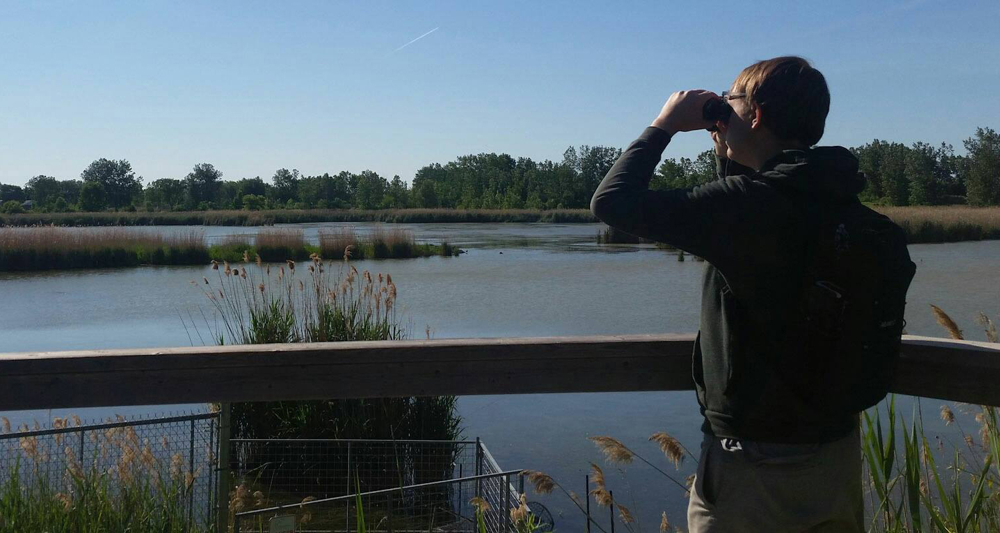

I'm a Computer Science and Statistics undergraduate student at the University of Guelph. My academic interests lie in ecological modelling and population risk assessment. I'm currently completing my first co-op term with Dr. Daniel Gillis in the School of Computer Science, University of Guelph. During this work term, I am developing an implementation of an environmental agent-based model to assess the effects of anthropogenic activities on endangered piping plovers.

My other interests involve citizen science, ornithology, and photography. I spend much of my free time birdwatching and contributing data to citizen science platforms such as eBird and iNaturalist. One day, I hope to do a big year, whether it be in Ontario, Canada, or Worldwide.