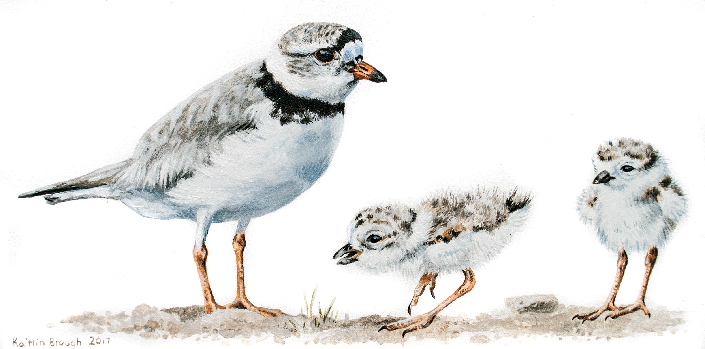

While attending the University of Guelph, I have had the priviledge of partaking in co-operative education. My overall goal of my co-op experiences was to be as interdisciplinary as possible while gaining out-of-the-classroom computer science knowledge. Computer science is a very versatile field that has applications in almost any other field, and I wanted to tap into some of those applications.

Below, you will find work reports from my completed co-op job experiences at the University of Guelph. Currently, Co-op Work Term 1 & 2 has been completed. Reports for Work Term 3 and Work Term 4 will be available September 2019 and September 2020, respectively.

# [Co-op Work Term 1 & 2](wt1.html)
My first two work terms took place at the University of Guelph's School of Computer Science. I took on the role of an Undergraduate Research Assistant under the direction of Dr Daniel Gillis. 

 

# [Co-op Work Term 3](wt3.html)
My third work term took place at the National Wildlife Research Centre in Ottawa, ON. There, I took on the role of Bird Population Monitoring Analyst under the direction of Dr Adam Smith.

