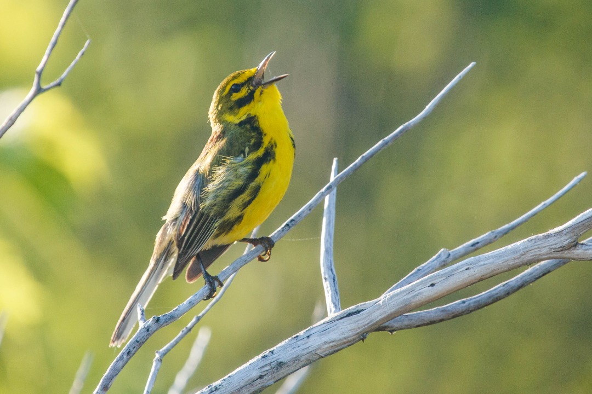
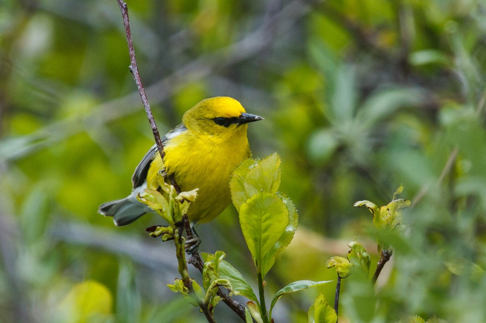
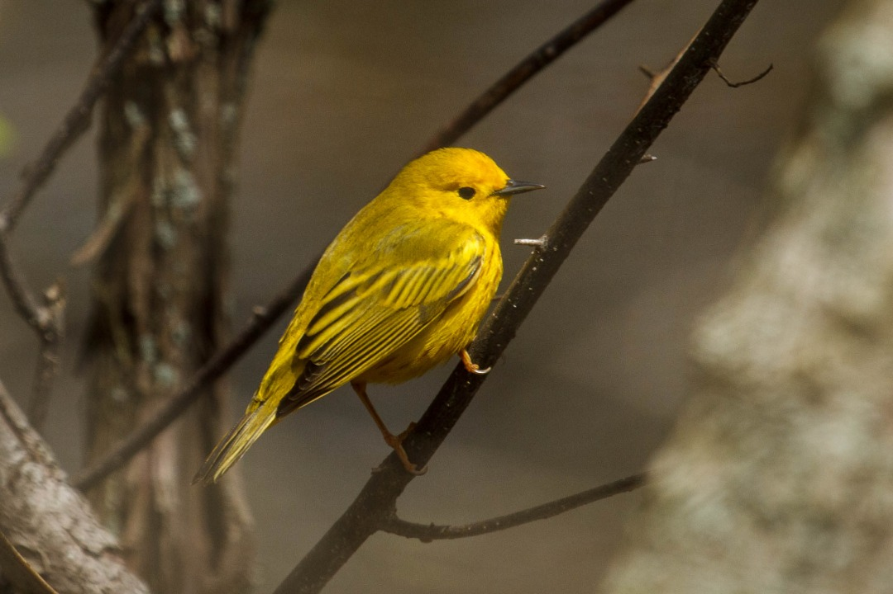
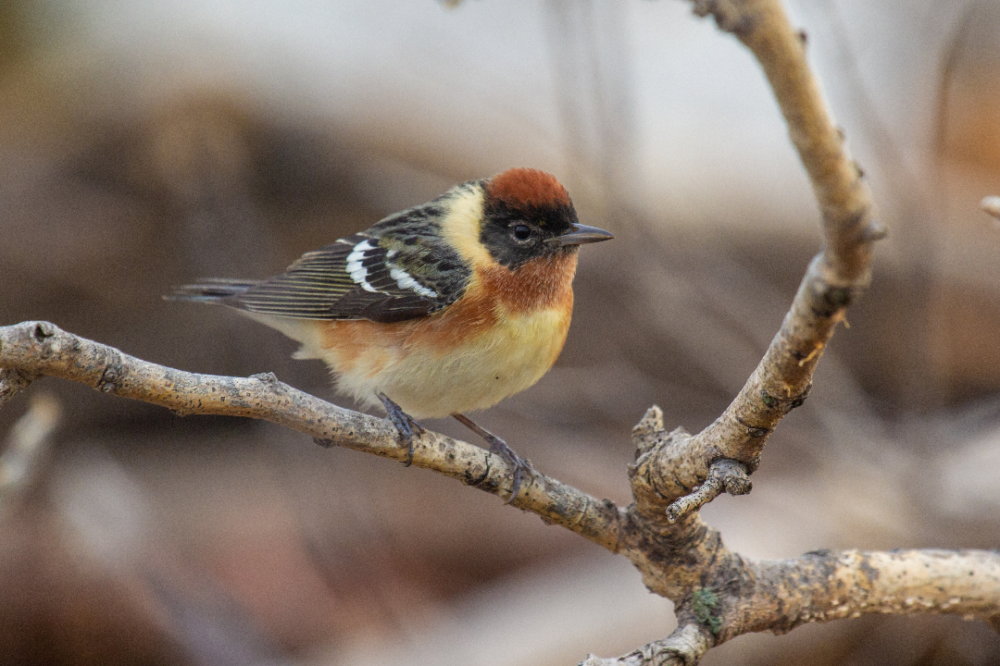
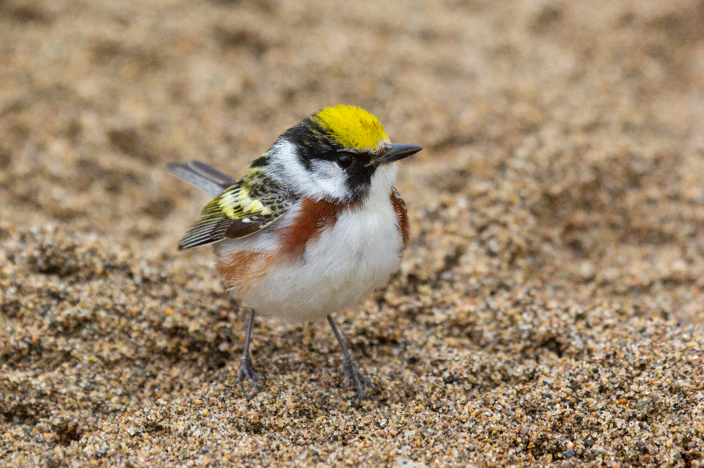
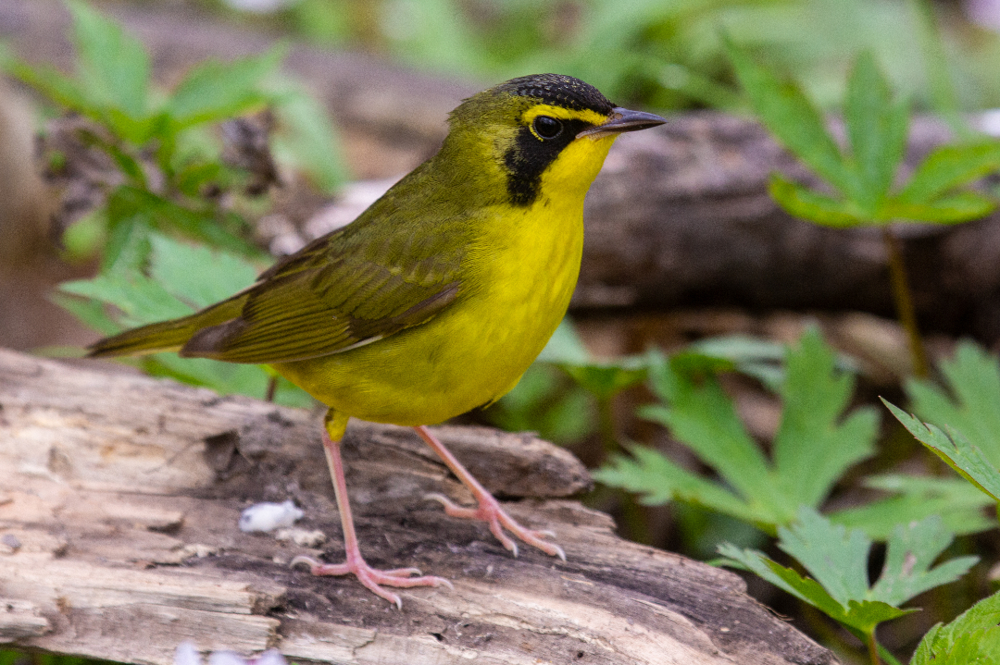
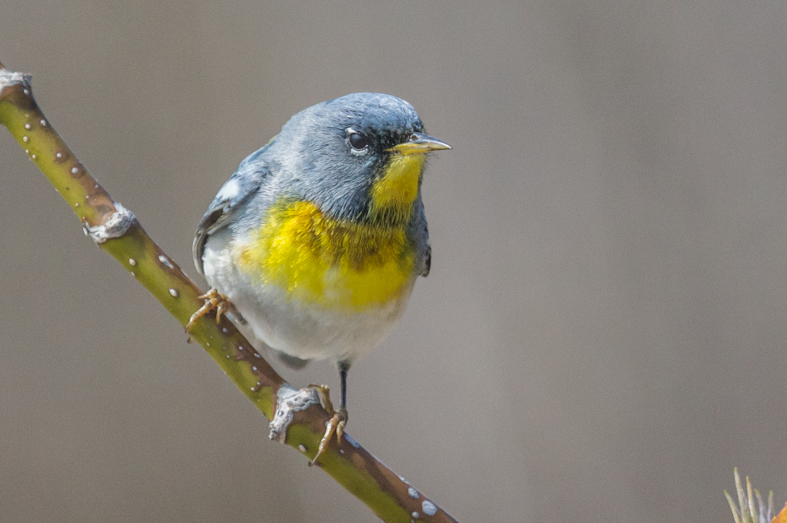
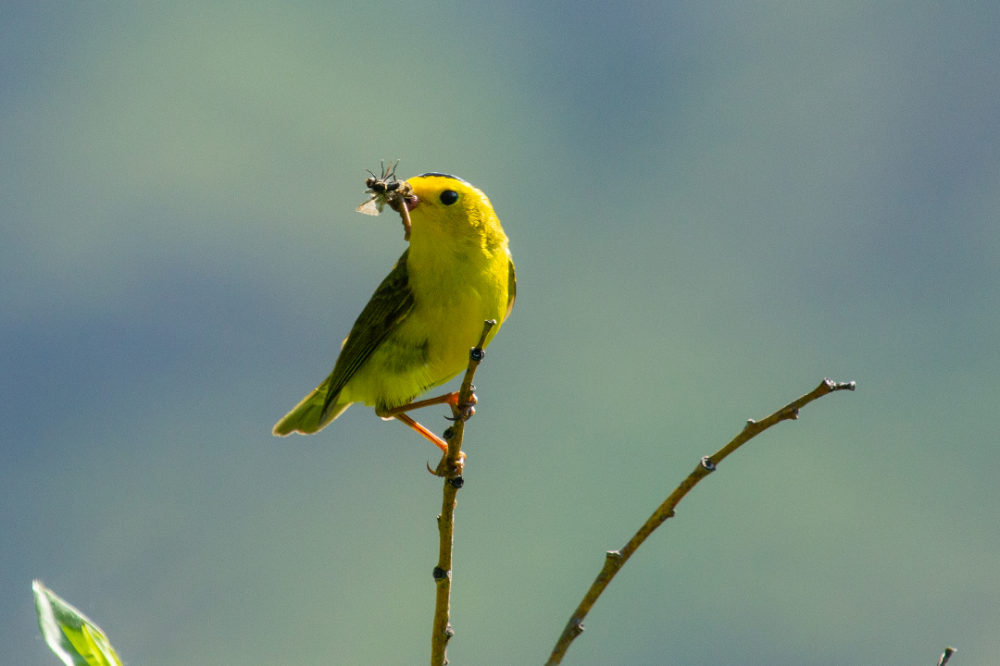
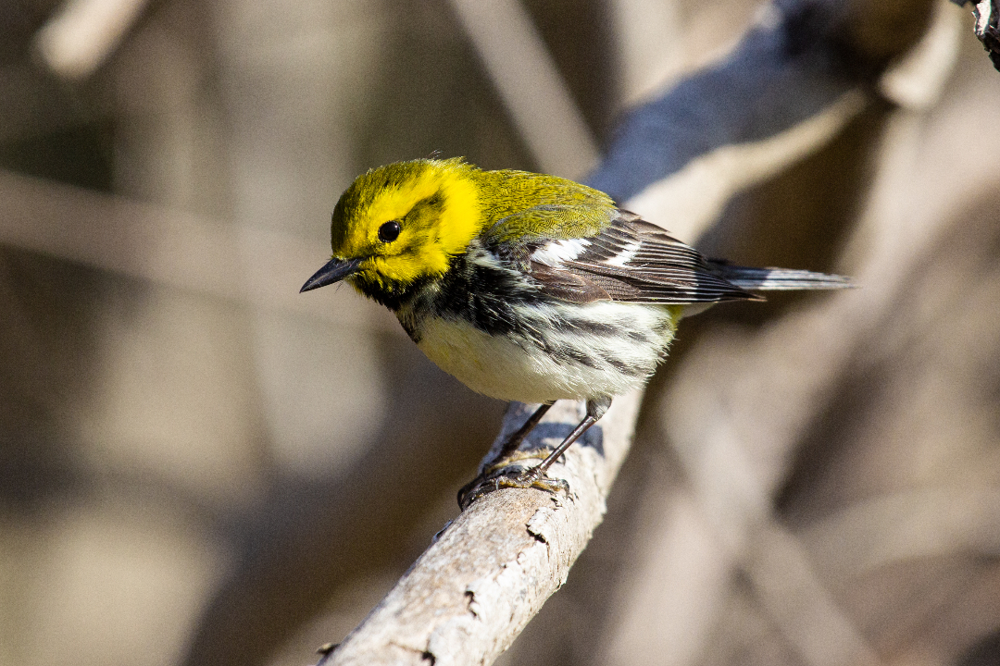

This vibrant group of birds occur only in North and South America. Each spring they travel thousands of kilometres from South and Central America north to the boreal forests of Canada and Alaska. May is one of the most exciting times of the year if you live in eastern North America, as thousands of individuals spanning over 50 species stop over in various forests to fuel their journey.

This group of birds is one of my favourite groups for multiple reasons. For one, their bright colours and seemingly positive energy fully push me into the excitement and happiness of the upcoming sunny days of spring and summer, especially after the cold, gloomy Canadian winters. However, I'm also drawn to their impressive and magical migration patterns. Most birds, including these warblers, migrate at night, relying on starlight and Earth's magnetic field alone to direct them to where they need to go. Any warbler I see on a chilly May morning in southern Ontario could very well have been in the southern United States only one day ago. This impressive feat happens year after year, and the pure magic of experiencing a spring migration in the east never fades.

### Prairie Warbler (*Setophaga discolor*)
Pinery Provincial Park, Ontario, Canada. 4 July 2021.

### Blue-winged Warbler (*Vermivora cyanoptera*)
Hillman Marsh Conservation Area, Ontario, Canada. 8 May 2021.

### Yellow Warbler (*Setophaga petechia*)
Point Pelee National Park, Ontario, Canada. 9 May 2021.

### Magnolia Warbler (*Setophaga magnolia*)
Point Pelee National Park, Ontario, Canada. 9 May 2019.

 

### Bay-breasted Warbler (*Setophaga castanea*)
Point Pelee National Park, Ontario, Canada. 9 May 2019.

 

### Chestnut-sided Warbler (*Setophaga pensylvanica*)
Point Pelee National Park, Ontario, Canada. 9 May 2019.

 

### Kentucky Warbler (*Geothlypis formosa*)
Point Pelee National Park, Ontario, Canada. 9 May 2019.

 

### Northern Parula (*Setophaga americana*)
Point Pelee National Park, Ontario, Canada. 8 May 2019.

### Wilson's Warbler (*Cardellina pusilla*)
Hatcher Pass, Alaska, USA. 29 June 2019.

### Yellow-rumped Warbler (*Setophaga coronata*)
Canatara Park, Sarnia, Ontario, Canada. 16 April 2017.

### Black-throated Green Warbler (*Setophaga virens*)
Forest, Ontario, Canada. 6 May 2020.

