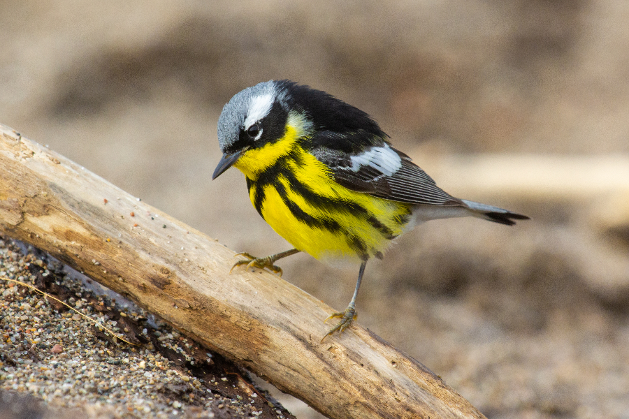

Photography has been a part of my life since I was 8 years old and received my first camera for Christmas. Over the years, I have experimented in different areas of photography, from weddings, to portraits, to astro, and numerous others. But one area of photography that I have stuck with is wildlife and nature photography. Below are various collections of wildlife photography that are all a constant work-in-progress.

## [New World Warblers](nw-warblers.html)
#### 8 Photos
This vibrant group of birds occur only in North and South America. Each spring they travel thousands of kilometres from South and Central America north to the boreal forests of Canada and Alaska. May is one of the most exciting times of the year if you live in eastern North America, as thousands of individuals spanning over 50 species stop over in various forests to fuel their journey.

